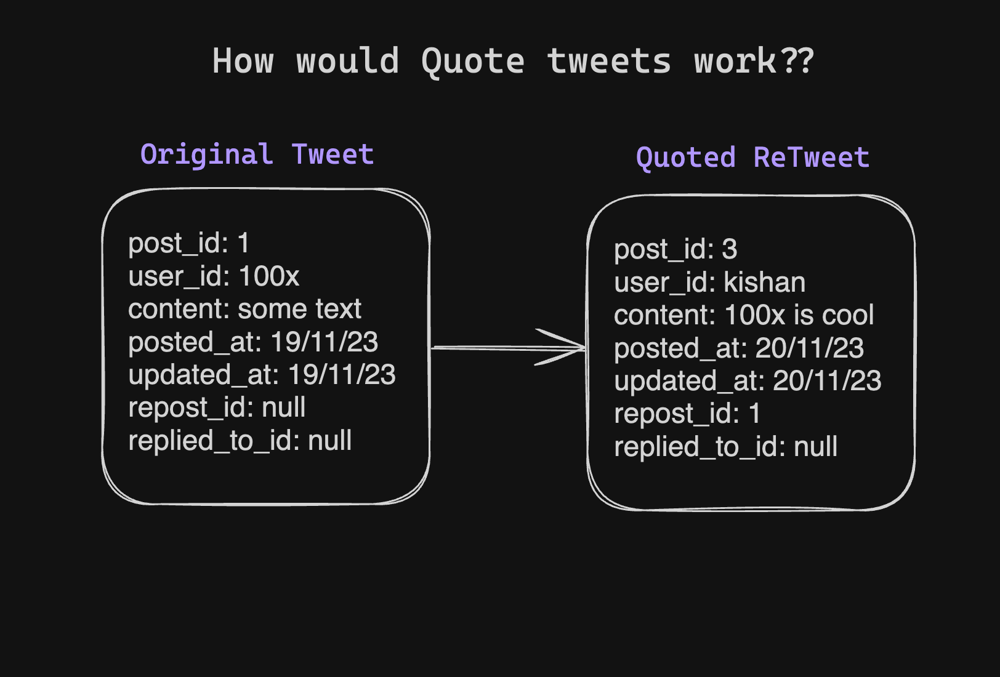

## Twitter Schema Design

### users (Entity: User)

- user_id: bigint - primary key - auto increment
- username: varchar(25) - unique
- email: varchar(50) - unique
- display_name: varchar(50)
- password: char(128) - hashed
- created_at: timestamp
- updated_at: timestamp
- website_link: varchar(100) - default null
- bio: varchar(160) - default null
- location: varchar(30) - default null
- birth_date: date - above 13 years
- profile_pic_url: varchar(100) - default null
- header_pic_url: varchar(100) - default null
- verified_on: timestamp - default null
- auth_token: char(224) <!-- length might change -->
- auth_session: char(20) <!-- length might change -->
- auth_session_expiry: timestamp

### followings (Entity: Following)

- followed_id: bigint - primary key - auto increment
- follower_id: bigint - foreign key
- following_id: bigint - foreign key - following_id != follower_id
- followed_at: timestamp

### likes (Entity: Like)

- liked_id: bigint - primary key - auto increment
- user_id: bigint - foreign key
- post_id: bigint - foreign key
- liked_at: timestamp

### posts (Entity: Post)

- post_id: bigint - primary key - auto increment
- user_id: bigint - foreign key
- content: varchar(1000) - 280 for unverified users - 1000 for verified users - can be null for reposts
- posted_at: timestamp
- updated_at: timestamp
- repost_id: bigint - foreign key - default null
- replied_to_id: bigint - foreign key - default null

### Reasoing for not using a single table for posts, reposts, quotes and replies

- Reposts are basically posts with content no content of their own but it shows as a post on the user's profile.
- Quotes are posts with content of their own and it shows as a post on the user's profile.
- Replies are posts linked to a post and have their own existence even if the original post is deleted.

`below is an example of a replies to deleted main post and its a few replies deleted as well`

#### How would retweets work?

- The repost will have a new post_id.
- A repost will have content as null and repost_id as the post_id of the original post.
- The repost will have the user_id of the user who reposted it and the posted_at and updated_at of the repost will be the timestamp of the repost.
  

#### How would quote posts work?

- The quote post will have a new post_id.
- A quote post will have content as string (varchar) and repost_id as the post_id of the original post.
- The quote post will have the user_id of the user who quoted it and the posted_at and updated_at of the quote post will be the timestamp of the quote post.
  

#### How would replies work?

- The reply will have a new post_id.
- A reply will have content as string (varchar) and replied_to_id as the post_id of the original post.
- The reply will have the user_id of the user who replied and the posted_at and updated_at of the reply will be the timestamp of the reply.
  

### How would threads work?

- Threads are basically replies to replies of original posts by the post's user.
- Each reply will be linked to a post with replied_to_id as the post_id of the original post.
- Visually it will look like a thread.
  
